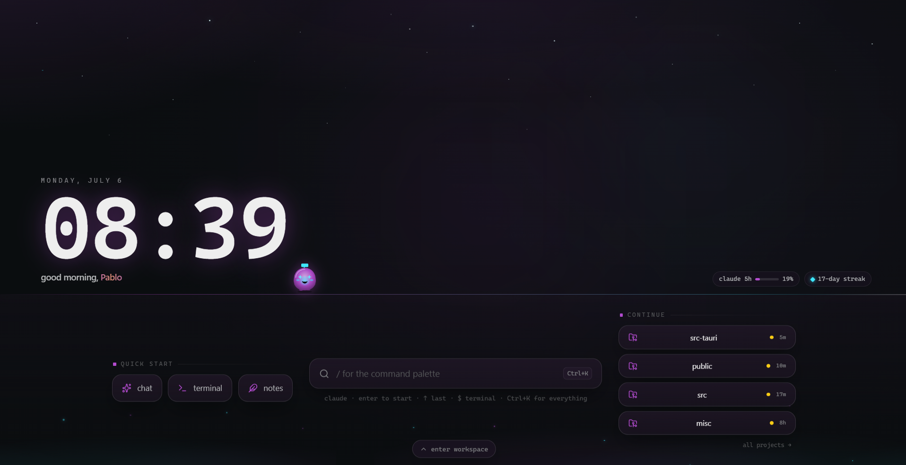
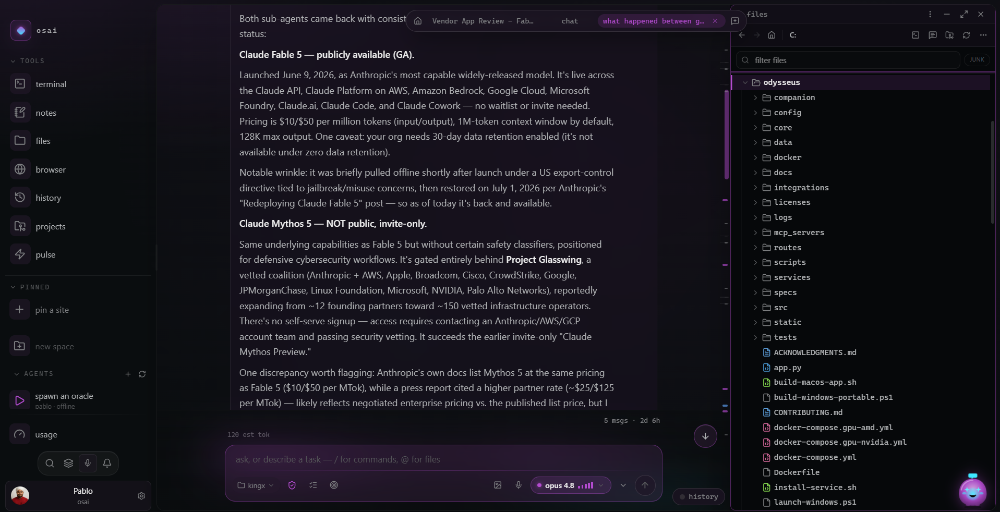
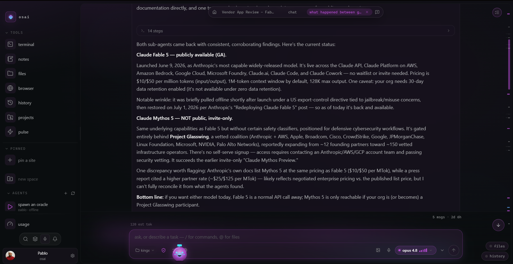
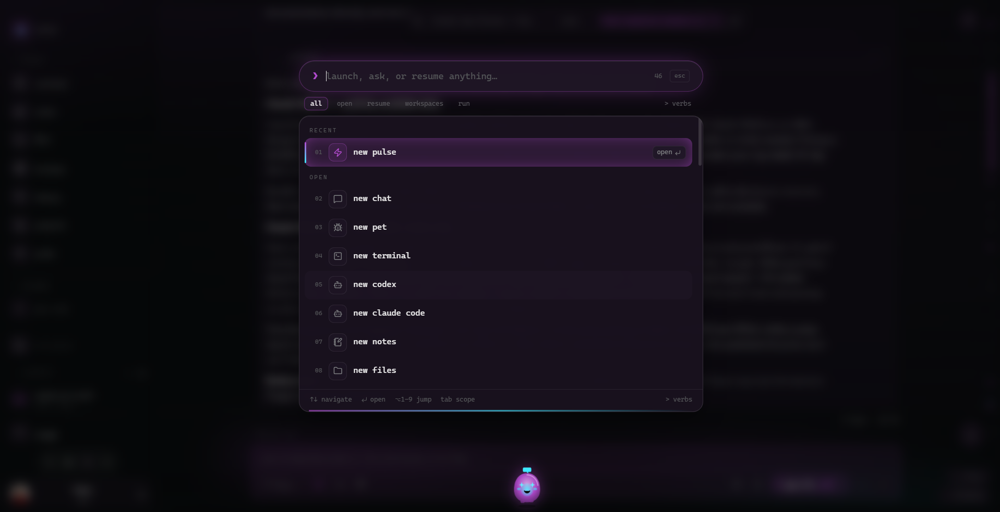
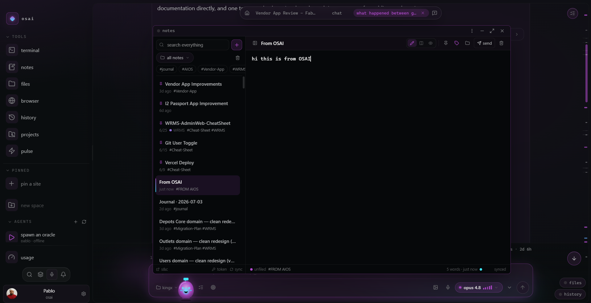
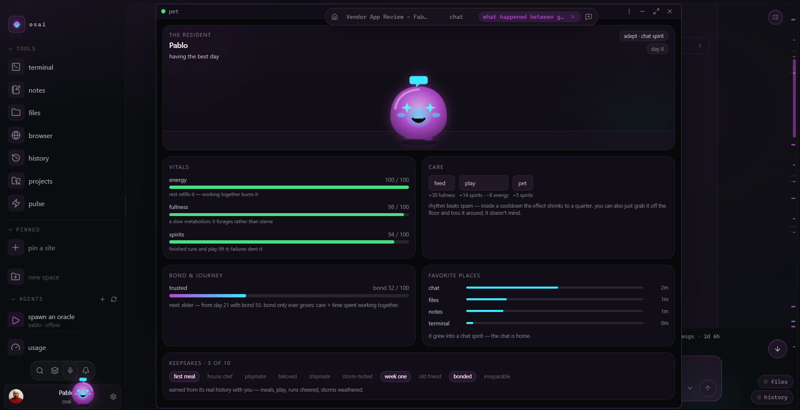
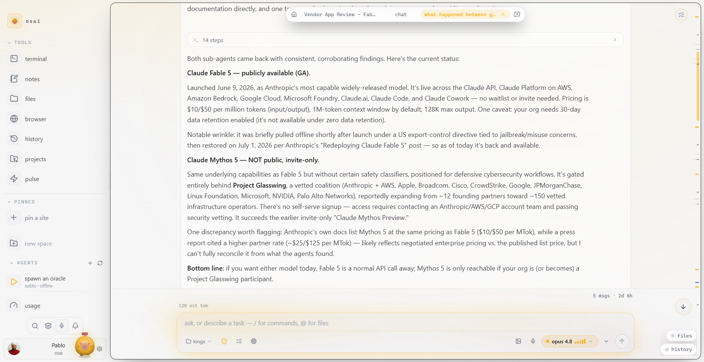

<div align="center">



<br /><br />

# OSAI

**The superapp for driving AI coding agents — one native window.**

Terminals · an agent roster · a multi-engine chat · an embedded browser · a file
explorer · a Monaco editor with language servers · live app-window mirroring · and
a push-to-talk conductor that builds your workspace from a sentence.

<sub>Native, fast, self-updating — and it runs on *your own* AI subscriptions, with no keys baked in.</sub>

<br />

[](#-requirements)
[](https://tauri.app)
[](https://react.dev)
[](https://rustup.rs)
[](https://www.typescriptlang.org)
[](./RELEASING.md)
[](./LICENSE)

<sub>Actively developed — it's the author's daily driver, updated most days.</sub>

<sub>Based on <a href="https://github.com/ferazfhansurie/aios-superapp"><b>Firaz Fhansurie's AIOS</b></a> —
OSAI is its Windows-first evolution, rebuilt and carried forward by Jul.Nazz.</sub>

</div>

---

<div align="center">

[**Screenshots**](#-screenshots) · [**What's inside**](#-whats-inside) · [**Requirements**](#-requirements) · [**Build & Run**](#-build--run) · [**Configuration**](#-configuration) · [**Architecture**](#-architecture) · [**Design**](#-design) · [**Roadmap**](#-roadmap)

</div>

<br />

OSAI is a desktop **superapp** for driving AI coding agents — a Rust (Tauri v2)
backend and a React + xterm.js frontend fused into a single native window where
**every pane is a tool**. One codebase, native on **macOS and Windows**.

> **It degrades gracefully.** OSAI runs fine on a plain machine with nothing but a
> terminal. No `claude` CLI? The chat pane sits quiet. No multiplexer (`tmux` on
> macOS/Linux, `psmux` on Windows)? The agent roster is just empty. Nothing
> errors — missing pieces simply go quiet.

## 📸 Screenshots

| One window, every tool | Agent-native chat |
| --- | --- |
|  |  |
| **⌘K — launch, ask, or resume anything** | **Notes — synced to your own cloud** |
|  |  |
| **The resident — it grows with how you work** | **Light theme — accent + glow are yours** |
|  |  |

## ✨ What's inside

OSAI is a **windowed workspace** — every tool is a floating window on one
canvas: drag, snap, tile, minimize to a tray, maximize, or fan everything out
in a Mission-Control-style overview. When nothing's open you land on the
**Horizon lock screen**: a monumental clock over a starfield, one glanceable
status row (agents live · usage · streak), a quick-start dock, a "continue"
shelf of your real projects and work sessions — and the resident glass spirit
strolling the horizon line. A calm, skippable **first-run onboarding** (welcome
→ your name → engine detection → MCP review → theme & accent) sets you up on
first launch.

<sub>Every capability below is one pane. Click any row to expand it.</sub>

<details>
<summary><b>💬 Chat</b> — multi-engine, local-first</summary>

<br />

A Codex-style chat pane that streams from a **local CLI** — so conversations run
on *your own* subscription with no API keys baked into the app.

- **Multiple engines** — `claude` (a persistent stream-json process), **Codex**
  (your ChatGPT subscription, the whole `gpt-5.x` family), and
  **Opencode/OpenRouter** with a zero-setup free fallback (`nemotron · free`).
  Swap engine and model from the model pill.
- **Model picker** — Opus 4.8 · Sonnet 4.6 · Haiku 4.5 · the `gpt-5.x` Codex
  family · a free OpenRouter model. The context window adapts to whichever model
  is live, and per-model rate windows show in the picker.
- **Effort levels** — `low · medium · high · xhigh · max · ultracode`, where
  *ultracode* layers orchestrated multi-agent fan-out (the Task tool) on top of
  xhigh and lights up an unmistakable "this is expensive" gradient.
- **Permission modes** — *ask each time · plan only · accept edits · full
  access*, with inline approval cards when the agent requests a tool.
- **Rich transcript** — user/assistant bubbles, collapsible thinking blocks with
  durations, and Codex-style tool-activity cards (verb · target · result · cost
  + token badge). Artifacts (Write/Edit) open straight into the file viewer or
  the code editor. Inline **question cards** when the agent asks you to choose.
- **Composer** — multi-line input, drafts autosaved per pane, image attach +
  paste + drag for vision, `/` slash menu, `@` file-mention picker, history
  recall, a true **stop** button, push-to-talk voice, and a **working-directory
  picker** so you can re-root the agent's session without leaving the pane.

</details>

<details>
<summary><b>🖥 Terminals</b> — real PTYs, persistent on both platforms</summary>

<br />

- Real PTYs streamed **per session over a Tauri Channel**, rendered with
  `xterm.js` + the **WebGL** addon (DOM fallback). Open as many as you want.
  PowerShell on Windows, your login shell on Unix.
- **Persistent shells on both platforms** — sessions route through a terminal
  multiplexer (`tmux` on macOS/Linux, `psmux` on Windows) as `aios-term-<pane>`,
  so they survive closing the pane *or* quitting the app. A closed session
  reappears in a **reattach** list in the sidebar — pop it back into a new pane,
  rename it, or kill it. With no multiplexer installed, terminals fall back to a
  plain (non-persistent) PTY — never an error.
- **Compose box** — a multi-line prompt bar (default-open for oracle/claude-code
  panes) with live mode/model/context pills parsed straight from the PTY output,
  plus slash commands sent raw to the shell.
- **Niceties** — copy-on-select, `Shift+Enter` soft newline, paste (images
  auto-saved + path inserted), middle-click paste, file-drop → shell-quoted
  paths, and a `[[btn: a | b | c]]` sentinel that renders clickable buttons.

</details>

<details>
<summary><b>🛰 Oracle roster</b> — multiplexer-backed agent sessions</summary>

<br />

Spawn, rename, hide, attach, and kill **multiplexer-backed agent sessions**
("oracles") from the sidebar — `tmux` on macOS/Linux, `psmux` on Windows. A
one-tap **spawn** boots a `claude` oracle; the superapp attaches to each as a
terminal, and a self-poll keeps the list live as sessions come and go. No
multiplexer installed → the roster is simply empty.

</details>

<details>
<summary><b>🌐 Browser</b> — a real native webview</summary>

<br />

A **native child webview** (real WebKit / WebView2, not an iframe) for docs,
dashboards, and previews without leaving the deck.

- URL bar with auto-https + search fallback, back/forward/reload, zoom (50–200%),
  and a device-emulation toggle.
- **Screenshot** to a temp file; **annotation mode** — click an element to
  capture a note + selector + text and route it into chat.
- **Cookie profiles** — separate storage jars per profile, so logins (Google,
  YouTube Premium, etc.) actually persist and stay isolated.
- **Pin to sidebar** — resolves the favicon and drops the site into your rail.

</details>

<details>
<summary><b>📁 Files</b> — a fast, git-aware explorer</summary>

<br />

A fast, VS Code-style explorer with a filterable tree, **git status**
decorations (M/A/D/U/R + folder "dirty" dots), indent guides, and type icons.
Single-click opens — code into the editor, media into the viewer. Drag any row
into a terminal or chat to insert its shell-quoted path.

</details>

<details>
<summary><b>✍️ Code editor & viewer</b> — Monaco with language servers</summary>

<br />

- **Editor** — Monaco (VS Code's engine): syntax highlighting, minimap,
  find/replace, multi-cursor, dirty/saved indicator, `⌘/Ctrl+S` to save, and a
  save-conflict banner (keep-mine / take-disk / show-diff) when a file changes
  underneath you.
- **Language servers** — a built-in **LSP** bridge wires real diagnostics,
  hover, go-to-definition, and completions into Monaco: TypeScript/JavaScript
  via `typescript-language-server` and Rust via `rust-analyzer`. Install the
  server binaries to light it up; absent, it quietly degrades to Monaco's
  built-in worker.
- **Viewer** — inline preview for images, PDFs, and office docs (via
  LibreOffice).

</details>

<details>
<summary><b>🪞 App mirror & attach</b> — cast a native window into a pane</summary>

<br />

Cast **one native app window** live into an OSAI pane — `ScreenCaptureKit` on
macOS, `Windows.Graphics.Capture` on Windows — so you can keep a design tool,
a simulator, or another app on the deck beside your agents. Pick a window from
the dropdown; the frame mirrors and tracks as you resize. (Display is shipped;
click/keystroke forwarding is in progress.)

</details>

<details>
<summary><b>🗒 Notes</b> — a native client for your own notes cloud</summary>

<br />

The notes pane is a full client for **Stone & Chisel** (the author's
self-hosted markdown notes app): connect once with a personal access token and
your notes live in *your* cloud, readable from any device.

- **Write / split / read** modes with the chat's markdown renderer, tags,
  folders, trash, and server-side search.
- **Offline-first** — edits queue in a local outbox and replay when the
  connection returns; concurrent edits resolve with a real **three-way
  (diff3) merge**, falling back to conflict markers only when both sides
  touched the same lines.
- **Agent-native** — chats and terminals can save selections and replies
  straight into notes, and control-plane verbs (`notes.list / read / create /
  append`) let agents file things for you. Local drafts work with no account
  at all.

</details>

<details>
<summary><b>🤖 Scheduled agents</b> — recurring in-app AI tasks</summary>

<br />

**Recurring AI tasks.** Give an agent a mission (the prompt it runs) and a
cadence — `hourly` · `daily` · `weekly` · `every N min/hours/days` · or `manual`
— and the in-app scheduler pulses it in a background chat, then fires a
clickable notification. **One-click starter templates** (repo digest, nightly
tests, dependency audit, URL watch, morning briefing) pre-fill the create form.
Each row shows its cadence, last-run age, and live state (scheduled / due /
manual); **run-now** fires a one-off pulse, and a **steer-all** box pushes a
control update into every agent at once. Open any one into a full chat to drive
it by hand. Pure in-app — no daemons — so it works the same on macOS and Windows.

</details>

<details>
<summary><b>📊 Pulse & usage</b> — your activity, read locally</summary>

<br />

The lock screen's status row, the pulse pane, and the account menu surface a
GitHub-style **activity heatmap**,
**current/longest streaks**, token totals, your favorite model, live **5h / 7d
rate-limit %**, and **device stats** (CPU, RAM, disk, battery, uptime) — all read
locally from your usage data, degrading to quiet zeros when absent.

</details>

<details>
<summary><b>🔌 Bridges · 🧩 Plugins · 🔔 Notifications</b></summary>

<br />

- **Bridges** — connection status for every channel OSAI can speak through
  (WhatsApp and more), detected via process, scheduler, and activity logs.
- **Plugins / skills** — a catalog of your OSAI skills (parsed from the skill
  index) plus the MCP servers wired into your `~/.claude.json`.
- **Notifications** — a center for agent + system events, with a **task
  monitor** that can watch an oracle's session and ping you when a task goes idle
  (done) or throws, with anti-spam guards so you get a signal, not noise.

</details>

<details>
<summary><b>🎙 Voice & the Conductor</b> — speak a workspace into existence</summary>

<br />

Hold to record, transcribe via a local **whisper.cpp** server, and either drop
the text into the focused composer **or** speak a whole workspace into
existence: the **Conductor** parses what you said into an ordered plan of
existing primitives — *"open a terminal and a browser on github.com, then ask
claude to wire up the deploy"* — and executes it over the pane bus. Routing
happens in plain code; it never pollutes the model's context.

</details>

<details>
<summary><b>🐾 The resident · 🎨 Theming</b> — delight & looks</summary>

<br />

- **The resident** — a glass-spirit companion with a real soul: needs
  (energy · fullness · spirits), a bond that only grows, life stages, and an
  evolution flavored by where you actually work. It roams the workspace floor
  (grab it, toss it, right-click to care), lives on the lock screen's horizon
  (and sleeps there at night), rarely speaks up with something *useful* — a
  finished run, an error, usage pace — as a click-to-jump bubble, and has a
  room pane with vitals, bond, and keepsakes earned from its real history
  with you. Fully gated by settings + reduce-motion.
- **Theming** — system / light / dark, a live **accent** picker *plus* a
  second **glow** accent (the cold neon: composer lip, send orb, the spirit's
  core), density, a font-size slider, an ambient flash-level, and a strict
  reduce-motion contract over the `motion`-based fx layer.

</details>

<details>
<summary><b>⌘ Command palette & shortcuts</b> — every action, one keystroke away</summary>

<br />

A Raycast-style fuzzy **command palette** groups every action into **open** (new
panes), **resume** (recent chats), **fleet** (oracles), **run** (auto-discovered
projects), **view**, **actions**, and **app**.

> Modifiers are platform-aware: **⌘ on macOS = Ctrl on Windows/Linux**. The keys
> below show the macOS glyphs.

| Shortcut | Action |
| --- | --- |
| `⌘K` | Command palette |
| `⌘B` | Toggle sidebar |
| `⌘T` / `⌘N` | New terminal |
| `⌘W` | Close focused pane |
| `⌘M` / `⌘⇧M` | Minimize focused pane / restore all |
| `⌘F` | Maximize (fullscreen) the focused pane |
| `⌘1`–`⌘9` | Jump to the Nth open pane |
| `` ⌘` `` | Mission-Control overview |
| `⌘R` | Reload the app |
| `⌘,` | Settings |
| `⌘J` | Voice dictation |
| `F5` | Run the detected project |
| `Esc` | Exit a maximized pane |
| **Chat** | `Enter` send · `Shift+Enter` newline · history recall · `@` files |
| **Terminal** | `Shift+Enter` soft newline · paste · copy · middle-click paste |
| **Editor** | `⌘/Ctrl+S` save |

</details>

<details>
<summary><b>⬆️ Self-update</b> — signed, automatic</summary>

<br />

OSAI updates itself. The in-app updater checks **GitHub Releases** for a newer
**minisign-signed** build, verifies the signature against a pinned public key,
downloads, installs, and relaunches — surfaced both at boot (quietly) and in
Settings › software update. See [`RELEASING.md`](./RELEASING.md) for how signed
release manifests are produced.

</details>

## 🚀 Requirements

**You need:**

- **macOS or Windows** — one codebase, native on both.
- **Rust** (stable, via [rustup](https://rustup.rs)) — for the Tauri backend.
  On Windows, the MSVC toolchain + **VS Build Tools 2022** ("Desktop development
  with C++").
- **Node** 18+ with **pnpm** — for the frontend (plain npm works too; see
  [`WINDOWS.md`](./WINDOWS.md) for the Windows guide).
- **WebView2** — preinstalled on Windows 11; renders the UI.

**Nice to have** — every one is optional, and OSAI degrades gracefully without it:

| Add this | To unlock |
| --- | --- |
| a `claude` CLI on your `PATH` | the chat pane |
| the `codex` and/or `opencode` CLIs | the other chat engines |
| a multiplexer — **tmux** (macOS/Linux) or **psmux** (Windows, `winget install psmux`) | the oracle roster + persistent/reattachable terminals |
| `typescript-language-server` / `rust-analyzer` | the editor's language features |
| a **whisper.cpp** server on `:9000` | push-to-talk voice |

> A few integrations (e.g. messaging bridges) are still Unix-oriented and stay
> quiet on Windows.

## 🛠 Build & Run

```bash
pnpm install          # install frontend deps
pnpm tauri dev        # run OSAI in dev (hot-reload frontend + backend)
pnpm tauri build      # produce a release bundle (.app / installer / binary)
```

On **Windows**, a helper script wraps the above (and falls back to npm when
pnpm isn't installed):

```powershell
.\scripts\run.ps1            # install deps (first run) + launch dev app
.\scripts\run.ps1 -Build     # produce an installer instead
```

> `pnpm dev` runs just the Vite frontend on `:1420`.

## ⚙️ Configuration

Everything below is **optional** — OSAI picks sensible defaults and runs with
none of it set. Use these env vars only to point it at a non-default layout:

| Variable | What it does | Default / fallback |
| --- | --- | --- |
| `OSAI_CLAUDE_BIN` | Override the `claude` CLI path. | resolved from `PATH` |
| `OSAI_CODEX_BIN` | Override the `codex` CLI path. | resolved from `PATH` |
| `OSAI_OPENCODE_BIN` | Override the `opencode` CLI path. | resolved from `PATH` |
| `OSAI_SKILL_INDEX` | Skill index (`_INDEX.md`) for the plugins pane. | `$HOME/.claude/skills/_INDEX.md`, then the first `$HOME/.claude/projects/*/skills/_INDEX.md`. None → empty list. |
| `OSAI_MEMORY_VAULT` | Markdown memory vault feeding the home-screen memory focus. | `$HOME/.claude/projects/<encoded-$HOME>/memory`, then the first `$HOME/.claude/projects/*/memory`, then `$HOME/.claude/memory`. |
| `VITE_OSAI_MIRROR_URL` | Cloudflare worker URL for the optional desktop-mirror feature (build-time). | none (mirror dormant) |

> Terminal + oracle sessions share one multiplexer socket, configurable in
> **Settings → terminal socket** (default `aios`) — `tmux` on macOS/Linux, `psmux`
> on Windows. The one-tap oracle name is **Settings → oracles → default oracle name**.

On Windows, `HOME` is aliased to `%USERPROFILE%` at startup, so all of the above
`$HOME`-rooted defaults resolve to your user profile. The MCP server list is read
from `~/.claude.json` automatically (no config). App state — settings, sidebar
layout, and per-pane chat drafts — persists in `localStorage` (`aios.settings`,
`aios.sidebar`, `aios-chat-draft:<pane>`).

## 🧩 Architecture

```
src/            React + TypeScript frontend (Vite)
  components/     one file per pane (Chat, Terminal, Editor, Browser, Files,
                  Notes, Pulse, Bridges, Plugins, AppCast, ScheduledAgents, Pet,
                  Viewer, Onboarding, …) + fx/ (the motion/fx primitives)
  lib/            thin Tauri-invoke wrappers, the pane bus, the conductor,
                  the LSP client, the updater, settings
  App.tsx         the shell — windowed workspace, lock screen, keybinds, dispatch
  App.css         the design system (color tokens, type scale, radii, spacing)
src-tauri/      Rust (Tauri v2) backend — #[tauri::command]s across:
  src/            pty · chat · browser · files · memory · oracles · lsp
                  appcast · wincast · monitor · bridges · plugins · device
                  stats · usage · control · snc (notes cloud) · apikeys
                  telemetry · diag · proc (no-window spawns)
  tauri.conf.json app config (name "OSAI", id com.julnazz.osai, window, bundle,
                  signed GitHub-Releases updater)
```

- **One pane = one component + one backend module + one lib wrapper.** Low
  coupling; adding a capability is a vertical slice, not a refactor.
- **Backend (Rust / Tauri v2)** exposes capabilities as `#[tauri::command]`
  functions. PTYs and the chat stream push output to the frontend over Tauri
  **Channels** (one per session) so terminals and chat update token-by-token.
  Every child process is spawned with a no-window flag (`proc.rs`) so a built
  Windows app never flashes a console.
- **Frontend (React / xterm.js / WebGL)** renders each capability as a pane.
  Terminals use `@xterm/xterm` (WebGL + fit + web-links); the editor is Monaco
  with an LSP bridge; a small pane bus coordinates cross-pane actions (appshot →
  chat, drag → terminal, send-to-AI, the conductor).
- **Chat** shells out to your local CLIs (`claude` in stream-json mode, `codex`,
  `opencode`), normalizing each engine's events to one shape — so the model runs
  on your own subscription, no keys in the app.
- **Native webview for the browser & app mirror** — real WebKit/WebView2 and
  capture-backed child views (not iframes), so sessions persist and frames are
  real. They paint *above* HTML, which is why maximizing a pane deactivates its
  siblings.

## 🎨 Design

Calm, chat-first, restrained. A near-black ground with generous negative space;
soft hairline borders; a four-step text hierarchy; monospace reserved for the
machine's voice (status, paths, tool names). The **accent is precious** — it
appears only for the primary action, the active/selected state, and the focus
edge. Never a default border, never every hover. When in doubt, make it quieter.
All of it lives as theme-aware CSS custom properties in `src/App.css`,
runtime-overridable for theme and accent. Motion is built on `motion` with a
strict reduce-motion contract and a tokenized fx layer (`src/components/fx/`).

## 🗺 Roadmap

Shipped and stable today: everything in **What's inside** above. On deck:

- **App-cast input forwarding** — click/scroll/keystroke through to the mirrored
  native window (display is already live).
- **Chat upgrades** — in-transcript find and a cumulative cost HUD
  (edit-and-resend, branching, and model handoff already shipped).
- **Model-agnostic chat** — BYO-key native-API engines on top of the shipped
  provider catalog + OS-keychain key storage.
- **Deeper Windows parity** — Windows-native equivalents for the few remaining
  Unix-only integrations (e.g. messaging bridges). Persistent/reattachable
  terminals and the oracle roster already work on Windows via `psmux`.

## 📄 License

[MIT](./LICENSE) © 2026 Jul.Nazz

<div align="center">
<br />
<sub>built with <a href="https://tauri.app">Tauri</a> · <a href="https://react.dev">React</a> · <a href="https://rustup.rs">Rust</a> · <a href="https://xtermjs.org">xterm.js</a> · <a href="https://microsoft.github.io/monaco-editor/">Monaco</a> · <a href="https://motion.dev">motion</a></sub>
<br /><br />
<sub><b>OSAI</b> — your AI co-founder's command deck.</sub>
</div>
