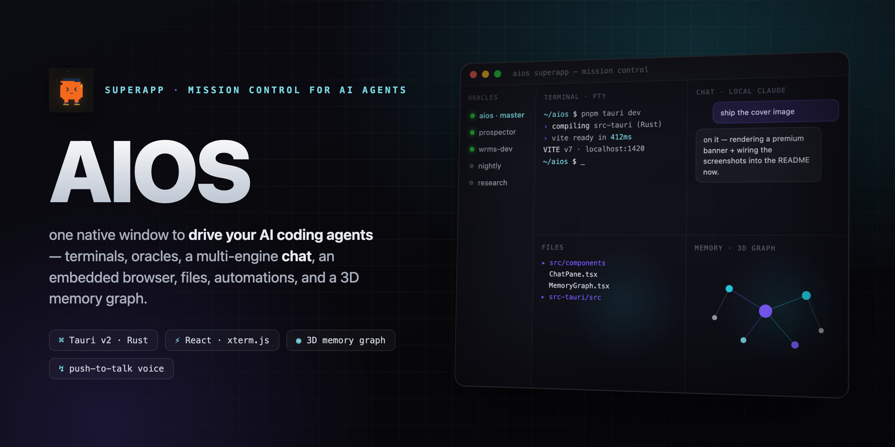
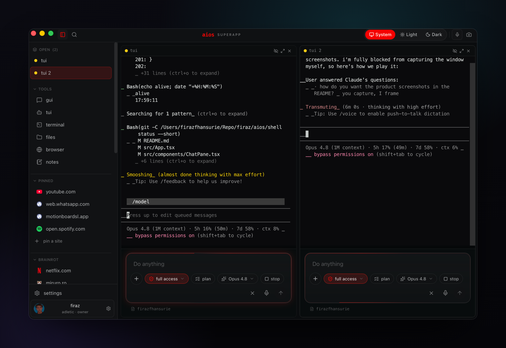
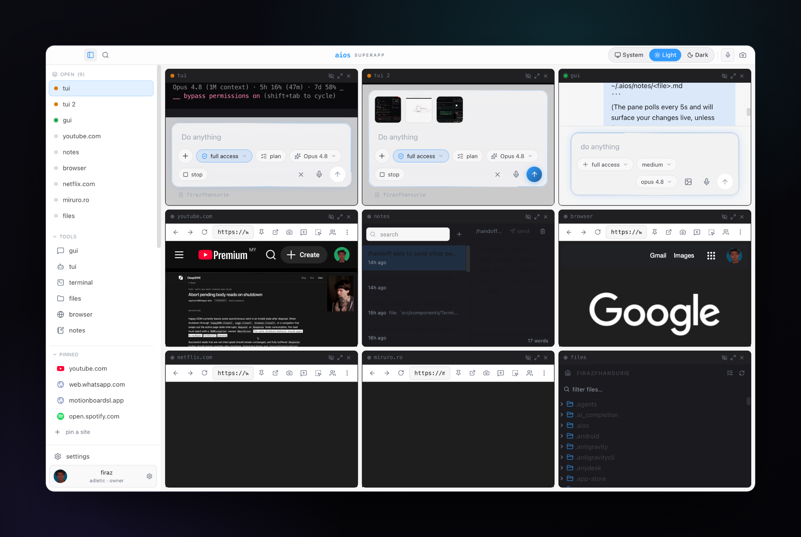
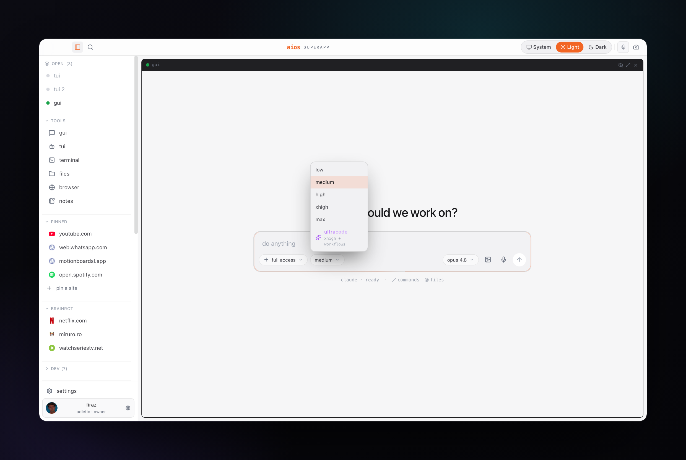
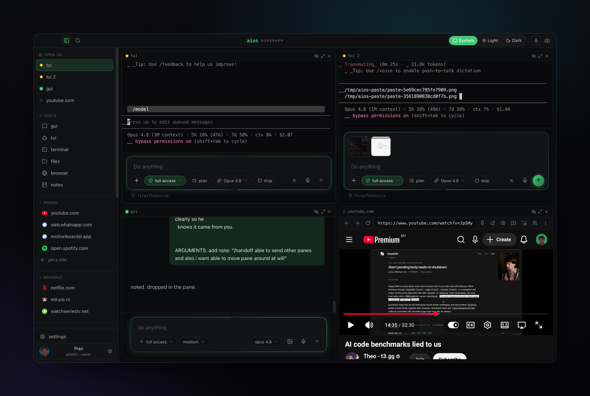

<div align="center">



<br /><br />

# AIOS

**the superapp for driving AI coding agents — one native window.**

terminals, oracles, a multi-engine chat, an embedded browser, a file explorer,
automations, bridges, and a 3D memory graph you can fly through. native, fast,
and it runs on your own AI subscriptions with no keys baked in.

<br />

[](#-requirements)
[](https://tauri.app)
[](https://react.dev)
[](https://rustup.rs)
[](https://www.typescriptlang.org)
[](./LICENSE)
[](./CHANGELOG.md)

<sub>actively developed — it's the author's daily driver, updated most days. see the **[changelog](./CHANGELOG.md)**.</sub>

</div>

---

AIOS is a desktop **superapp** for driving AI coding agents. It wraps a Rust
(Tauri v2) backend and a React + xterm.js frontend into a single native window
where **every pane is a tool**: terminals, an agent roster, a
multi-engine chat, an embedded browser, a file explorer, a 3D memory graph,
automations, bridges, and a plugin/skill catalog.

It's the control surface for the [AIOS](https://github.com/ferazfhansurie/aios)
stack — but it **degrades gracefully** and runs fine on a plain machine with
nothing but a terminal. No tmux? The oracle roster is just empty. No `claude`
CLI? The chat pane sits quiet. No memory vault? The graph is empty. Nothing
errors; missing pieces simply go quiet.

## 📸 Screenshots

| The deck | Tile everything |
| --- | --- |
|  |  |
| **Light theme + model picker** | **Embedded browser** |
|  |  |

## ✨ What's inside

AIOS is built around a **resizable pane grid** — open as many tools as you want,
drag the dividers, maximize (`⌘F`), minimize to the sidebar (`⌘M`), or fan them
all out in a Mission-Control-style overview (`` ⌘` ``). When nothing's open you
land on an **idle dashboard**: a bento grid of your pulse, recent projects, dev
status, pinned sites, device stats, and fleet roster.

### 💬 Chat — multi-engine, local-first

A Codex-style chat pane that streams from a **local CLI** — so conversations run
on *your own* subscription with no API keys baked into the app.

- **Multiple engines** — `claude` (persistent stream-json process), **Codex**
  (your ChatGPT subscription), and **Opencode/OpenRouter** with a zero-setup
  free fallback model. Swap from the model pill.
- **Model picker** — Opus 4.8 (1M ctx) · Sonnet 4.6 · Haiku 4.5 · Codex · the
  context window adapts to whichever model is live.
- **Effort levels** — `low · medium · high · xhigh · max · ultracode`, where
  *ultracode* layers orchestrated multi-agent workflows on top of xhigh.
- **Permission modes** — *ask each time · plan · accept edits · full access*,
  with inline approval cards when the agent requests a tool.
- **Rich transcript** — user/assistant bubbles, collapsible thinking blocks with
  durations, and Codex-style tool-activity cards (verb · target · result · cost
  + token badge). Artifacts (Write/Edit) open straight into a file viewer or the
  code editor.
- **Composer** — multi-line input, drafts autosaved per pane, image attach +
  paste + drag for vision, `/` slash menu, `@` file-mention picker, `⌘↑/↓`
  history recall, a true **stop** button, and push-to-talk voice dictation.

### 🖥 Terminals — real PTYs

- Real PTYs streamed **per session over a Tauri Channel**, rendered with
  `xterm.js` + the **WebGL** addon (DOM fallback). Open as many as you want.
- **Persistent shells** route through a `tmux` session (`aios-term-<pane>`) so
  they survive an app quit; oracle/raw panes stay ephemeral.
- **Compose box** — a multi-line prompt bar (default-open for oracle/claude-code
  panes) with live mode/model/context pills parsed straight from the PTY output,
  plus slash commands sent raw to the shell.
- **Niceties** — copy-on-select, `Shift+Enter` soft newline, `⌘V` paste (images
  auto-saved + path inserted), middle-click paste, file-drop → shell-quoted
  paths, and a `[[btn: a | b | c]]` sentinel that renders clickable buttons.

### 🛰 Oracle roster

Spawn, rename, attach, and kill **`tmux`-backed agent sessions** ("oracles")
from the sidebar. A pinned, undeletable **master** session sits on top. The
superapp attaches to each as a terminal. No tmux → the roster is simply empty.

### 🌐 Browser — a real webview

A native **WKWebView** child (real WebKit, not an iframe) for docs, dashboards,
and previews without leaving the deck.

- URL bar with auto-https + search fallback, back/forward/reload, zoom (50–200%),
  and a device-emulation toggle.
- **Screenshot** to a temp file; **annotation mode** — click an element to
  capture a note + selector + text and route it into chat.
- **Cookie profiles** — separate storage jars per profile, so logins (Google,
  YouTube Premium, etc.) actually persist and stay isolated.
- **Pin to sidebar** — resolves the favicon and drops the site into your rail.

### 📁 Files

A fast, VS Code-style explorer with a filterable tree, **git status**
decorations (M/A/D/U/R + folder "dirty" dots), indent guides, and type icons.
Single-click opens — code into the editor, media into the viewer. Drag any row
into a terminal or chat to insert its shell-quoted path.

### ✍️ Code editor & file viewer

- **Editor** — Monaco (VS Code's engine): syntax highlighting, minimap,
  find/replace, multi-cursor, dirty/saved indicator, `⌘S` to save.
- **Viewer** — inline preview for images, PDFs, and office docs.

### 🗒 Notes

An Apple-Notes-style scratch pad over your markdown files — search, create,
delete, autosave (debounced + on blur), word count, and a **5s live sync** so
edits made by an oracle show up without clobbering what you're typing. "Send to
AI" routes a note straight into chat.

### 🧠 Memory graph

An Obsidian-style view of your local markdown "memory" vault, with two modes:

- **3D graph** — force-directed (`3d-force-graph` over three.js): every note is
  a node sized by link-degree and colored by type, every `[[wikilink]]` an edge,
  with bloom glow and animated link particles. Click a node to fly to it.
- **Table** — sortable, searchable, with inline create/edit/delete of memory
  files (name · type · description · body).

### 🗄 Database

A query workbench for **Postgres** (including Neon) and **MySQL**, over an async
`sqlx` driver. Add a connection (tested before it's saved, stored locally at
`0600`), browse tables, page through rows, run arbitrary SQL, and edit / insert /
delete rows inline. Postgres results are serialized server-side via `to_jsonb`
for clean rendering.

### 👥 Contacts & customer inbox

A customer-comms surface that merges your **WhatsApp logs** (inbound + outbound)
with a **local CRM** (contacts + deals at `~/.aios/state/crm.json`), deduped by
handle and sorted newest-first. Open a thread to see the full history; quick-reply
sends straight through the bridge's `push.js`.

### 🎨 Studio (MotionBoards)

Generate **images and video** from a canvas pane via the
[MotionBoards](https://motionboards.vercel.app) API — browse the model catalog,
check your credit balance, fire sync/async jobs with live status polling, and
read/write shared board state. A thin server-side bridge keeps your Bearer key
off the frontend (set `AIOS_MOTION_KEY`).

### 📊 Pulse & usage

The idle dashboard and account menu surface a GitHub-style **activity heatmap**,
**current/longest streaks**, token totals, your favorite model, live **5h / 7d
rate-limit %**, and **device stats** (CPU, RAM, disk, battery, uptime) — all read
locally from your Claude usage data, degrading to quiet zeros when absent.

### ⚙️ Automations · 🔌 Bridges · 🧩 Plugins

- **Automations** — a dense status board for always-on daemons and scheduled
  jobs: it reads `launchd` jobs, your proactive plan, and live background tmux
  sessions, with per-row state dots, schedule chips, "last fired" times, failure
  pills, and expandable rows (command, log tail, run-now, enable/disable).
- **Bridges** — connection status for every channel AIOS can speak through
  (WhatsApp live; Instagram / Threads / Google Chat / X / Telegram / Gmail /
  iMessage on the way), detected via process, `launchd`, and activity logs.
- **Plugins / skills** — a catalog of your AIOS skills (parsed from the skill
  index) plus the MCP servers wired into your `~/.claude.json`.
- **Task monitor** — point it at an oracle's tmux session and it pings you on
  **WhatsApp** when the task goes idle (done) or throws an error, with anti-spam
  guards so you get a signal, not noise.

### 🎙 Voice · 📸 Appshot · 🎨 Theming

- **Push-to-talk voice** — hold to record, transcribe via a local **whisper.cpp**
  server, and drop the text into the focused chat composer, terminal compose box,
  or PTY (clipboard fallback).
- **Appshot** (`⌘⌘`) — grabs a screenshot and pipes its path into the master
  oracle for instant visual context.
- **Theming** — system / light / dark, a live **accent color** picker, density
  (comfortable / compact), font-size slider, and a reduce-motion toggle.

### ⌘ Command palette

`⌘K` opens a Raycast-style fuzzy palette grouped into **open** (new panes),
**resume** (recent chats), **fleet** (oracles), **customers**, **run** (auto-
discovered `~/Repo` projects), **view**, **actions**, and **app**.

<details>
<summary><b>⌨️ Full keyboard shortcut reference</b></summary>

| Shortcut | Action |
| --- | --- |
| `⌘K` | Command palette |
| `⌘B` | Toggle sidebar |
| `⌘T` / `⌘N` | New terminal |
| `⌘W` | Close focused pane |
| `⌘M` / `⌘⇧M` | Minimize focused pane / restore all |
| `⌘F` | Maximize (fullscreen) the focused pane |
| `⌘1`–`⌘9` | Jump to the Nth open pane |
| `` ⌘` `` | Mission-Control overview |
| `⌘R` | Reload the app |
| `⌘,` | Settings |
| `⌘⌘` | Appshot (screenshot → oracle) |
| `⌘J` | Voice dictation |
| `F5` | Run the detected project |
| `Esc` | Exit a maximized pane |
| **Chat** | `Enter` send · `Shift+Enter` newline · `⌘↑/↓` history · `@` files |
| **Terminal** | `Shift+Enter` soft newline · `⌘V` paste · `⌘C` copy · middle-click paste |
| **Editor** | `⌘S` save |

</details>

## 🚀 Requirements

- **macOS** (primary target; the Tauri shell is cross-platform but the agent
  integrations assume a Unix host).
- **Rust** (stable, via [rustup](https://rustup.rs)) — for the Tauri backend.
- **Node** 18+ and **pnpm** — for the frontend.
- _Optional:_ **tmux** + a `claude` CLI on your `PATH` — for the chat pane and
  the oracle roster. Without them those panes are simply empty.
- _Optional:_ a **whisper.cpp** server on `:9000` — for push-to-talk voice.
- _Optional:_ the `codex` CLI — to use the ChatGPT-subscription chat engine.

## 🛠 Build & Run

```bash
pnpm install          # install frontend deps
pnpm tauri dev        # run AIOS in dev (hot-reload frontend + backend)
pnpm tauri build      # produce a release bundle (.app / .msi / binary)
```

(`pnpm tauri` proxies the Tauri CLI; `pnpm dev` runs just the Vite frontend on
`:1420`.)

## ⚙️ Configuration

Everything below is **optional** — AIOS picks sensible defaults and runs with
none of it set. Use these env vars only to point it at a non-default layout:

| Variable | What it does | Default / fallback |
| --- | --- | --- |
| `AIOS_MEMORY_VAULT` | Markdown memory vault for the 3D graph. | `$HOME/.claude/projects/<encoded-$HOME>/memory`, then the first `$HOME/.claude/projects/*/memory`, then `$HOME/.claude/memory`. None → empty graph. |
| `AIOS_SKILL_INDEX` | Skill index (`_INDEX.md`) for the plugins pane. | `$HOME/.claude/skills/_INDEX.md`, then the first `$HOME/.claude/projects/*/skills/_INDEX.md`. None → empty list. |
| `AIOS_ORACLE_SOCKET` | tmux socket oracle sessions run on. | `adletic` |
| `AIOS_MASTER_SOCKET` | tmux socket the master session lives on. | `aios` |
| `AIOS_MASTER_SESSION` | name of the pinned master session. | `aios` |
| `AIOS_CLAUDE_BIN` | override the `claude` CLI path. | resolved from `PATH` |

The MCP server list is read from `~/.claude.json` automatically (no config).
App state — settings, sidebar layout, and per-pane chat drafts — persists in
`localStorage` (`aios.settings`, `aios.sidebar`, `aios-chat-draft:<pane>`).

## 🧩 Architecture

```
src/            React + TypeScript frontend (Vite)
  components/     one file per pane (Chat, Terminal, Editor, Browser, Files,
                  Notes, Memory, Database, Contacts, Studio, Pulse,
                  Automations, Bridges, Plugins, Viewer, …)
  lib/            thin Tauri-invoke wrappers + the pane event bus
  App.tsx         the superapp shell — pane grid, layout, keybinds, dispatch
  App.css         the design system (color tokens, type scale, radii, spacing)
src-tauri/      Rust (Tauri v2) backend — ~47 #[tauri::command]s across:
  src/            pty · chat · browser · files · memory · oracles · voice
                  db · crm · inbox · motion · automations · bridges · plugins
                  device · stats · usage · telemetry · monitor
  tauri.conf.json app config (name "AIOS", id com.adletic.aios, window, bundle)
```

- **One pane = one component + one backend module + one lib wrapper.** Low
  coupling; adding a capability is a vertical slice, not a refactor.
- **Backend (Rust / Tauri v2)** exposes capabilities as `#[tauri::command]`
  functions. PTYs and the chat stream push output to the frontend over Tauri
  **Channels** (one per session) so terminals and chat update token-by-token.
- **Frontend (React / xterm.js / WebGL)** renders each capability as a pane.
  Terminals use `@xterm/xterm` (WebGL + fit + web-links); the memory graph uses
  `3d-force-graph` over three.js; the editor is Monaco; a small pane bus
  coordinates cross-pane actions (appshot → chat, drag → terminal, send-to-AI).
- **Chat** shells out to your local CLIs (`claude` in stream-json mode, `codex`,
  `opencode`), normalizing each engine's events to one shape — so the model runs
  on your own subscription, no keys in the app.
- **Native webview for the browser** — a real WebKit child (not an iframe), so
  sessions and logins persist. It paints *above* HTML, which is why maximizing a
  pane deactivates its siblings.

## 🎨 Design

Calm, chat-first, restrained. A near-black ground with generous negative space;
soft hairline borders; a four-step text hierarchy; monospace reserved for the
machine's voice (status, paths, tool names). The **Adletic-orange accent is
precious** — it appears only for the primary action, the active/selected state,
and the focus edge. Never a default border, never every hover. When in doubt,
make it quieter. All of it lives as theme-aware CSS custom properties in
`src/App.css`, runtime-overridable for theme and accent.

## 🗺 Roadmap

Shipped and stable today: everything in **What's inside** above. On deck:

- **Customizable sidebar** — pin/reorder/rename/hide anything (drag-and-drop).
- **Control plane** — expose every UI action over localhost HTTP + MCP so an
  agent can drive the superapp exactly like a human.
- **Chat upgrades** — edit-and-resend a prior message, retry-with-different-model
  without losing the thread, in-transcript find, a cumulative cost HUD, and
  richer markdown (tables, task lists, syntax highlighting).
- **Model-agnostic chat** — a live model catalog, OpenRouter key onboarding, and
  BYO-key native APIs (OpenAI / OpenRouter / Ollama) with secure key storage.
- **Windows port** — a ConPTY-host daemon for tmux-style detach/reattach.

## 🙏 Credits

Built by [Adletic](https://github.com/ferazfhansurie) as the control surface for
**AIOS**. Standing on the shoulders of [Tauri](https://tauri.app),
[React](https://react.dev), [xterm.js](https://xtermjs.org),
[three.js](https://threejs.org), [Monaco](https://microsoft.github.io/monaco-editor/),
and the Claude / Codex CLIs.

## License

[MIT](./LICENSE) © 2026 Adletic / Firaz Hansurie
